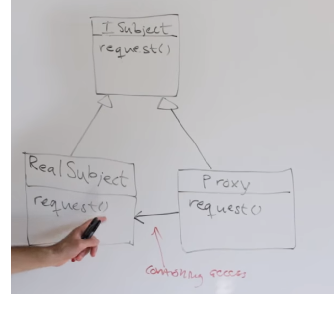

##Proxy Pattern

In proxy pattern, a class represents functionality of another class. This type of design pattern comes under structural pattern.

In proxy pattern, we create object having original object to interface its functionality to outer world.

Proxy Pattern have three (versions/styles/ways). They are Remote, Virtual and Protection. 

**Remote proxy** is suggested to be used when you want to access resources that are remote (on different server).

**Virtual proxy** controls access to resources that are expensive to create. For example loading of large images from hdd (like caching). Only when you really need to interact proxy will interact with hist resource. 

**Protection proxy** control access to resource based on access rights. If you allowed to make that call you will make that call if you are not allowed you can't make that call. 